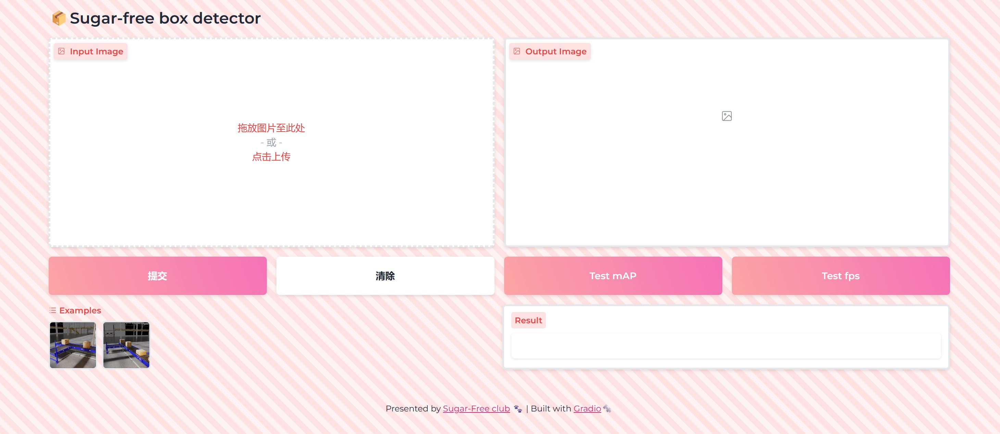

# BoxDetector

We are participating in the NVIDIA 8th Sky Hackathon.

## Features

- **Data Synthesis**: Utilizing NVIDIA Omniverse Replicator to create virtual dataset. 

    The objects in our virtual scenario are:
    
    - A factory model as background scenario.
    - 14 boxes with differents style and random movements. 
    - 6 light nodes with random position and color.
    - A camera to take photos and generate the data.
    - Other objects to enrich the scenario.
        - 3 people.
        - A robot arm.
        - A customize conveyor.

    The dataset contains 10000 photos generated by above scenario.
- **Detector and Training**: A customized box detecting model and trained by PyTorch.
- **Model Deployment**: Model is optimized by NVIDIA TAO and accelerated by NVIDIA TensorRT.
- **Interactive Web Page**: Built a demo on web page by Gradio.
  
  

## Usage

Server: NVIDIA RTX2080Ti to prepare data and train models.

Device: NVIDIA XAVIER NX to deploy models.

We recommended using JetPack5.0+ on the device for running our web page, otherwise you should upgrade Python version to at least 3.7. There are some scripts in the root path of this repo, but we cannot guarantee their correctness.

### Preparing data

Using NVIDIA Omniverse Replicator to prepare datasets.

`data_version` is used to control the data version. Please modify it in our scripts.

Copy the code in `genreate_data.py` into the Python Script window in Omniverse Code and run it to build the environment and configure the sampling. Running the Replicator to generate data. After generating, packing data by running `pack_data.sh` script. The package should be sent to the training server.

All objects in the scenario can be configured in `genreate_data.py`. 

### Training

We use NVIDIA TAO to train SSD models. You can learn from [model_gym/ModelGym.ipynb](./model_gym/ModelGym.ipynb).

We use [MMYOLO](https://github.com/open-mmlab/mmyolo) to train YOLO models. Configs are inside [weights](./weights/).

### Deployment

We use `trtexec` to export TensorRT engines. You can also find some scripts in [weights](./weights/)

### Web show

Our web UI is based on Gradio and built on Xavier NX device. First we should upgrade python version to 3.7 and install some libraries. Please run our prepared script `pre.sh`.

After preparing, run `web/app.py` to launch the application. You can change the content of `server_name` and `server_port` in the python file to configure the application.
